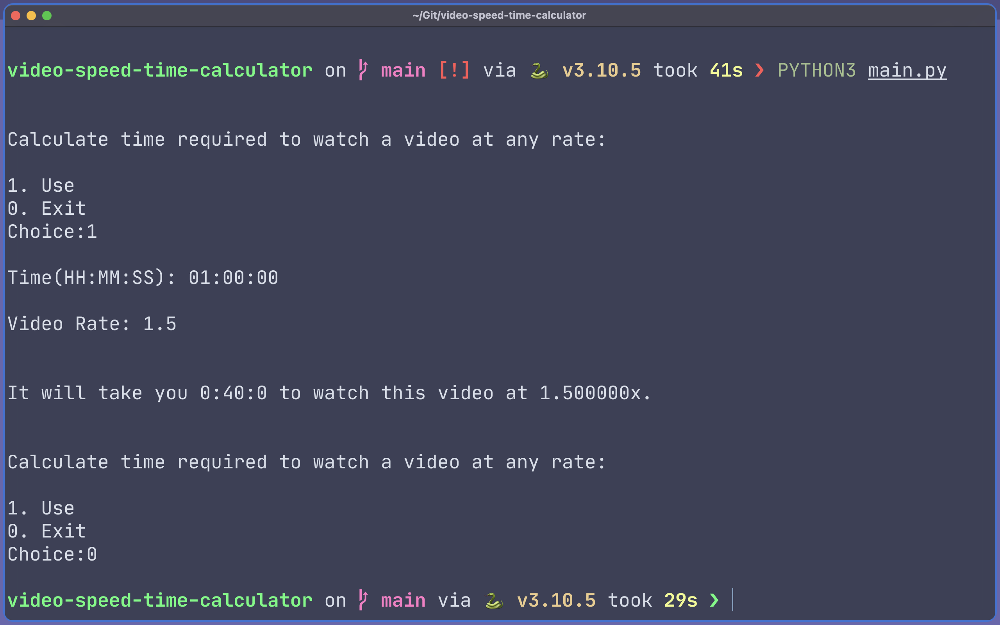

# video-speed-time-calculator

2x takes half time but what about in-betweens?

My brain cannot process the time required by a [23:05] min long video if I play it at [1.25x].
Thus this calculator. 

---

 
 

---
